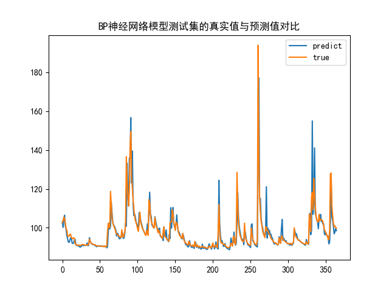
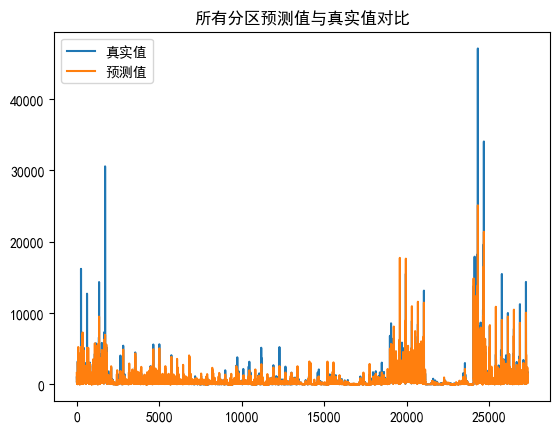
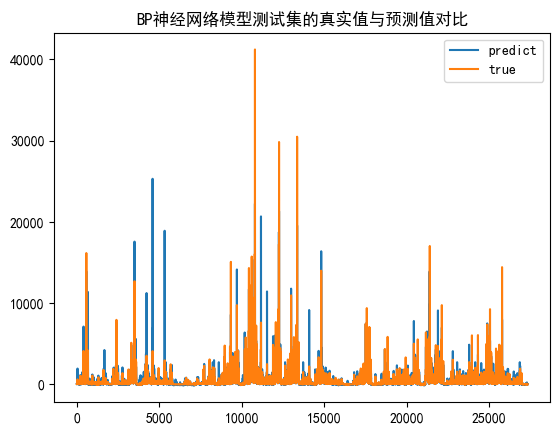

```
Python 3.9.18
pandas 2.2.1
numpy 1.26.4
pillow 10.2.0
seaborn 0.13.2
scipy 1.12.0
scikit-learn 1.4.1.post1
matplotlib 3.8.3
```
使用requirements.txt安装依赖时请注意，因为minepy库在windows下安装会出现问题，请单独安装项目内minepy库。

## 数据集内容理解
- *Date*: 日期
- *Discharge*: 流量
- *Dayl*: 每天白天的持续时间（以秒为单位）。此计算基于一天中太阳位于假设的平坦地平线上方的时间段
- *Prcp*: 每日总降水量（毫米）。所有形式降水的总和转换为水当量深度。
- *Srad*: 入射短波辐射通量密度（以瓦/平方米为单位），取一天中白天时段的平均值。注：每日总辐射量（MJ/m2/day）可计算如下：（（srad (W/m2) * dayl (s/day)）/l,000,000）
- *Swe*:  雪水当量，单位为千克每平方米。积雪中所含的水量。
- *Tmax*: 每日最高 2 m 气温（摄氏度）。
- *Tmin*: 每日最低 2 m 气温（摄氏度）。
- *Vp*:   水蒸气压（以帕斯卡为单位）。日平均水蒸气分压。

## ToDo List
- #### 第一阶段任务：3.6-4.9
- [x] 数据分析，可视化与数据统计
- [x] 数据预处理，数据清洗与特征补充
- [x] 特征工程，特征归一化与特征选择
- [x] 机器学习回归模型
- [x] 反归一化
- [x] 网格搜索调超参数
- [x] 径流预报模型找最优特征工程方法+机器学习算法组合
- [x] 运行得到最终结果
- #### 第二阶段任务：4.10-5.21
- [x] 降维提取特征
- [x] Kmeans聚类
- [x] 肘部法则
- [x] 评估指标（SSE）
- [x] DBSCAN聚类
- [x] 层次聚类
- [x] 空间多尺度建模
- #### 第三阶段任务：5.23-6.11
- [ ] 集成学习
- [ ] 报告撰写

## 项目日志
- 2024-3-7 已完成数据可视化分析，utils.data_process中有添加五天内的径流量数据的函数。已完成Z-score标准化与min-max标准化，在utils.data_process中；在初始读入时删去swe（似乎在所有数据中均为零）。
- 2024-3-8 已完成特征筛选，皮尔逊和最大系数法，在utils.feature_select中。封装特征选择类，皮尔逊相关系数法、最大信息系数法、距离相关系数法、SVM法。
- 2024-3-9 完成机器学习回归模型，包括BP神经网络与支持向量机，已完成网格搜索法，已完成反归一化但是效果不太好，已完成最优模型计算。
- 2024-4-12 完成聚类的类，已完成肘部法则，已完成KMeans聚类，已完成DBSCAN聚类，已完成层次聚类。
- 2024-5-14 完成空间多尺度建模，已完成分区建模，已完成全区建模。

## 阶段成果
- 最优模型：<u>*BP神经网络*</u>，最优特征选择方法：<u>*SVM法*</u>，最优归一化方法：<u>*min_max*</u>，测试集MSE：<u>*2444.30*</u>，如下图所示：

- 分区建模结果R2:0.7836（注：真实值不同是因为摆放顺序不同）

- 全区建模结果R2:0.7289（注：真实值不同是因为摆放顺序不同）


## 项目说明
### 第一阶段
- 我们举出了四种特征选择方法，分别是皮尔逊相关系数法、最大信息系数法、距离相关系数法和SVM法
- 近年来，随着各类机器学习算法的提出，采用机器学习方法进行中长期径流预报逐渐成为趋势。闪丽洁等在大通、屏山和汉口3个站点基于BP人工神经网络模型开展径流预报研究，模拟效果较好；郑炎辉等在新丰江水库构建了机器学习模型，开展枯水期中长期径流预报，计算结果精度较高。 预报因子筛选对于提高预报精度具有十分重要的意义。国内外众多学者在筛选预报因子时，常将历史径流和降雨等这些与流域径流密切相关的因素考虑在内。由于主成分分析法能够有效地处理因子冗余和信息重叠等问题，因此被广泛应用于水文预报中。周淼等以径流和降雨等气象因子为数据驱动，基于主成分分析采用局域回归的方法对宜昌站径流进行预报，预测精度较高。
- **主成分分析、BP人工神经网络、随机森林模型、支持向量回归模型**成为径流预测的常规手段
### 第二阶段
- 我们采用数据集内全部特征进行聚类，并特别加入了径流量的频谱数据以增强对周期性的识别，在聚类上，我们采用了KMeans聚类、DBSCAN聚类和层次聚类，最终选择KMeans作为聚类方法，并通过肘部法则和SSE值来确定最优聚类数。
- 由于数据维度较高，我们采用了PCA降维方法，将数据降至5维，以便于聚类。
- 通过第一阶段搭建的模型，我们完成了分区建模和全区建模，分区建模的R2值为0.7836，全区建模的R2值为0.7289。